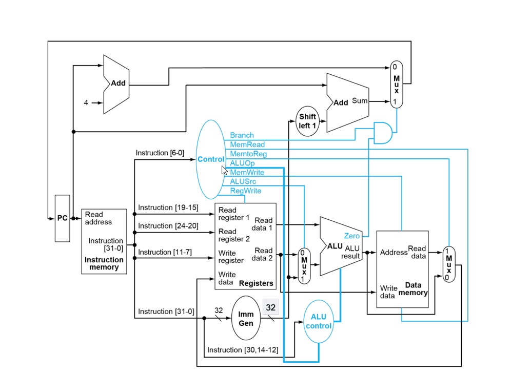

# 🧠 RISC 32I Single-Cycle Processor

## 📘 Overview

This project implements a **RISC 32I (RV32I-compatible) Single-Cycle Processor** using **Verilog HDL**.  
The processor follows the **RISC-V 32-bit integer instruction set** and executes **one instruction per clock cycle**, integrating instruction fetch, decode, execute, memory, and write-back stages within a single clock period.

The design also includes **on-board display outputs**:
- **LEDs** to visualize processor control signals or instruction bits.
- **Seven-Segment Display (SSD)** to display intermediate data such as PC, ALU results, and register values.

---


## 🧭 Datapath Diagram

The following diagram illustrates the full **RISC 32I Single-Cycle Datapath**, showing how each module connects — including instruction fetch, decode, execution, memory access, and write-back stages.



*Figure: Complete Single-Cycle Processor Datapath*

---

## ⚙️ Features

- **RISC-V 32I Instruction Set Compatibility**
- **Single-Cycle Execution**
- **Separate Instruction and Data Memory**
- **ALU with Configurable Operations**
- **Immediate Generator (ImmGen)**
- **Branching Support**
- **Memory Read/Write**
- **Register File with Two Read Ports and One Write Port**
- **Dynamic Output Selection for Debugging via LEDs & 7-Segment Display**

---

## 🧩 Module Hierarchy

```text
Full_SingleCycle_Processor
│
├── SingleCycle
│   ├── Register (Program Counter)
│   ├── InstMem (Instruction Memory)
│   ├── ControlUnit
│   ├── ImmGen (Immediate Generator)
│   ├── ALU_ControlUnit
│   ├── Shift_Left
│   ├── RegisterFile
│   ├── Mux (used for ALU input, PC selection, Mem-to-Reg)
│   ├── ALU
│   ├── DataMem (Data Memory)
│   └── Adder Logic (Branch + Normal PC increment)
│
└── Seven_Segment_Driver (for SSD display)

```

---

## 🖥️ Top-Level Module: `Full_SingleCycle_Processor`

### **Ports**
| Signal | Direction | Width | Description |
|:-------|:-----------|:-------|:-------------|
| `fastclk` | Input | 1 | High-frequency clock for SSD refresh |
| `slowclk` | Input | 1 | Processor clock (controls instruction execution) |
| `rst` | Input | 1 | Asynchronous reset |
| `ledSel` | Input | 2 | Selects LED display mode |
| `ssdSel` | Input | 4 | Selects SSD display content |
| `leds` | Output | 16 | Displays instruction or control information |
| `ssd_out` | Output | 7 | Seven-segment cathode signals |
| `Anodes` | Output | 4 | Seven-segment anode enable signals |

---

## 🧠 Internal Module: `SingleCycle`

This is the main **processor datapath** module.  
It integrates all control and data flow components to execute one RISC-V instruction per clock cycle.

### **Key Components**

| Component | Description |
|:-----------|:-------------|
| **PC (Program Counter)** | Holds the current instruction address |
| **InstMem** | Fetches instruction based on PC value |
| **ControlUnit** | Generates control signals (`Branch`, `MemRead`, `RegWrite`, etc.) |
| **ImmGen** | Extracts immediate values from instruction |
| **ALU_ControlUnit** | Determines ALU operation based on `func3`, `func7`, and `ALUOp` |
| **Shift_Left** | Shifts immediate value for branch address calculation |
| **RegisterFile** | Stores and retrieves register values (R1, R2, etc.) |
| **ALU** | Executes arithmetic and logical operations |
| **DataMem** | Handles memory load/store instructions |
| **Muxes** | Used for selecting ALU input, PC source, and Write-back data |
| **Adder Logic** | Computes next PC and branch target addresses |

---

## 🔦 Display Control (Debugging Aids)

### **LED Display (`ledSel`)**

| `ledSel` | LEDs Show |
|:----------|:------------|
| `00` | Lower 16 bits of current instruction |
| `01` | Upper 16 bits of current instruction |
| `10` | Control/Status bits (ALUOp, ALUsel, ALUSrc, flags, etc.) |
| `11` | Default off (`0`) |

**Control Signal Breakdown (when `ledSel = 10`):**
leds = { 2'b00, ALUOp, ALUsel, ALUSrc, ZFlag, PCsel, Branch, MemRead, MemtoReg, MemWrite, RegWrite }


---

### **Seven-Segment Display (`ssdSel`)**

| `ssdSel` | Displayed Value |
|:----------|:----------------|
| `0000` | Current PC (`PCOut`) |
| `0001` | PC + 4 (Next Sequential Address) |
| `0010` | Branch Target Address |
| `0011` | Next PC (`PCIn`) |
| `0100` | Read Data 1 (from Register File) |
| `0101` | Read Data 2 (from Register File) |
| `0110` | Write Data (to Register File) |
| `0111` | Immediate Value |
| `1000` | Shifted Immediate |
| `1001` | ALU Input Operand |
| `1010` | ALU Result |
| `1011` | Data Memory Output |
| *Default* | Zero (0) |

---

## 🧮 Key Internal Signals

| Signal | Width | Description |
|:--------|:-------|:-------------|
| `PCIn`, `PCOut` | 32 | Current and next PC values |
| `Inst` | 32 | Current fetched instruction |
| `ALU_Result` | 32 | Output of the ALU |
| `ZFlag` | 1 | ALU zero flag for branch decisions |
| `MemtoReg` | 1 | Selects between ALU result or memory data for write-back |
| `BranchAdderOut` | 32 | Computed branch address |
| `NormalAdderOut` | 32 | Next sequential instruction address (PC + 4) |
| `PCsel` | 1 | Chooses next PC source (branch vs. sequential) |

---


